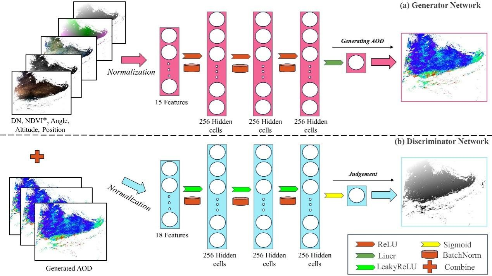
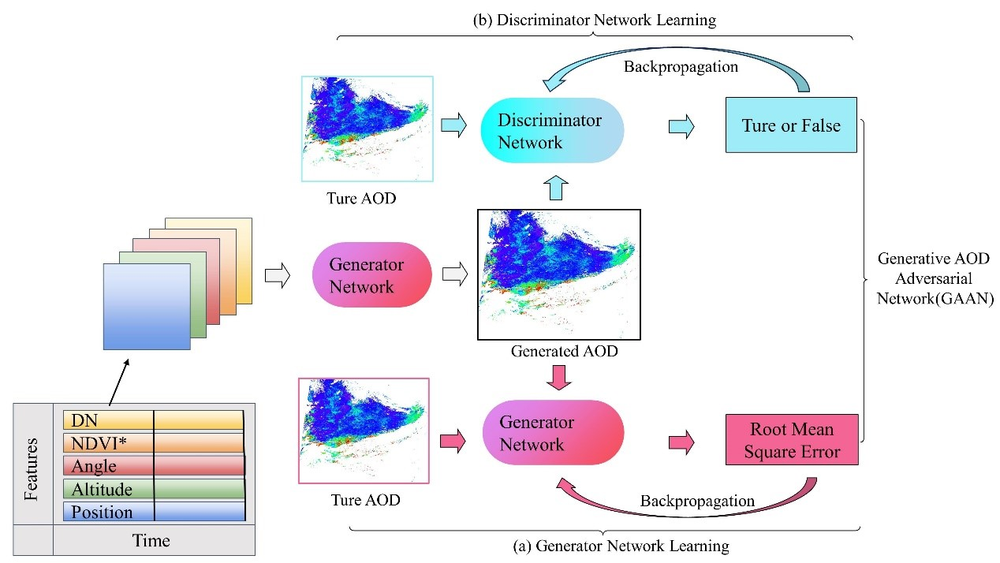
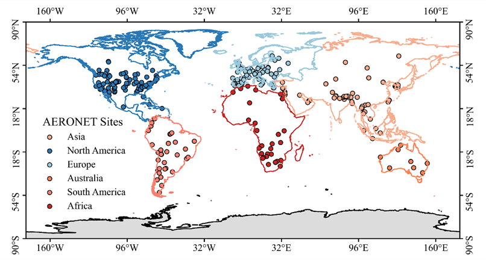

# GANN
The Generative AOD Adversarial Neural Network (GANN) is a neural network model used for satellite aerosol optical depth (AOD) retrieval. 

The GANN_Train.py can be used to train your GANN model based on your sample. The flowing Sample section provides some data as an example.
# Train flow

GANN construction：

GANN training flow：

# Sameple

The data named '2014_2018_sample_550_Selection.csv' is the AOD samples matching Terra (MODIS) and AERONET sites from 2014 to 2018 worldwide.

